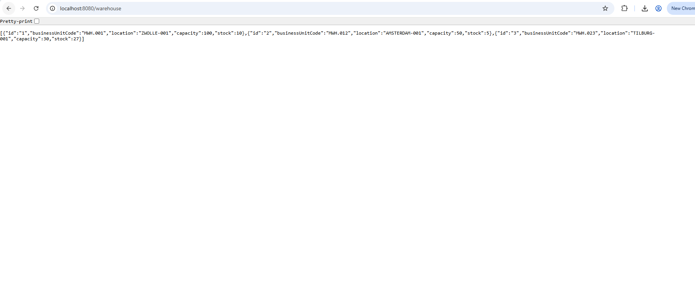
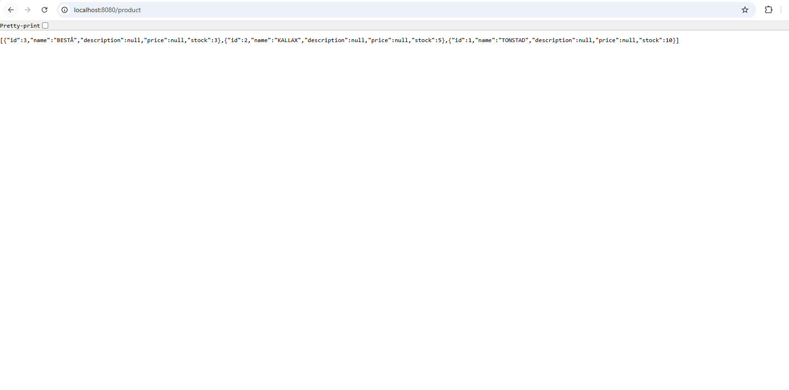
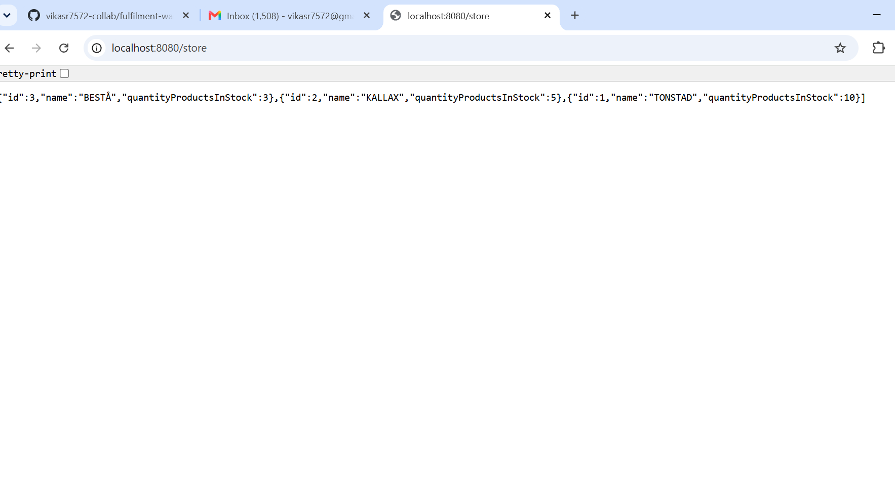
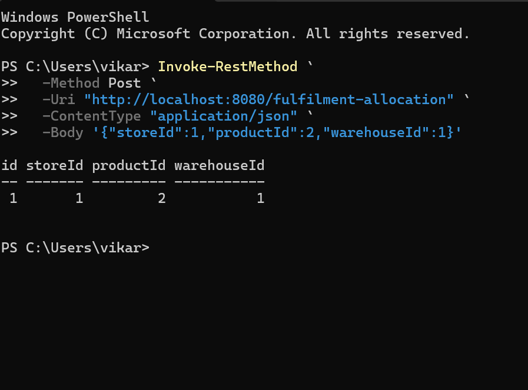

# Fulfilment Warehouse Assignment

[](https://github.com/vikasr7572-collab/fulfilment-warehouse-assignment/actions/workflows/ci.yml)

A Quarkus-based Java application for managing stores, products, warehouses, and fulfilment allocations. This repository contains the completed coding assessment, supporting case study, automated tests, and GitHub Actions quality checks.

## Highlights

- REST endpoints for stores, products, and warehouse lifecycle operations.
- Dedicated warehouse validators for business-unit, location, capacity, stock, and replacement rules.
- Transaction-safe Store integration using a CDI event observer that invokes the legacy gateway only after a successful database commit.
- Bonus fulfilment allocation feature organized into domain, application, ports, adapters, and validator layers.
- Embedded H2 for local development and tests; PostgreSQL Docker Compose configuration for the production profile.
- Automated tests and a JaCoCo coverage gate of at least 80% for core business rules, enforced by GitHub Actions.

## Architecture

The Warehouse and Fulfilment modules use a pragmatic hexagonal structure:

- `domain` — models, ports, and business validators
- `application` — use cases that orchestrate domain operations
- `adapters` — REST and database implementations at the system boundary
- `stores/events` — a CDI `AFTER_SUCCESS` observer for confirmed Store changes

This keeps HTTP, persistence, and validation concerns separate and makes business rules straightforward to unit test.

## Run locally

From the `java-assignment` directory:

```powershell
.\mvnw.cmd verify
.\mvnw.cmd quarkus:dev
```

The application starts at `http://localhost:8080`. Full endpoint and Docker instructions are in the [application README](java-assignment/README.md).

## Application screenshots

The application was started locally with Quarkus and H2 sample data. These endpoint responses demonstrate the running API:









## Documentation

- [Assignment requirements](java-assignment/CODE_ASSIGNMENT.md)
- [Technical questions and answers](java-assignment/QUESTIONS.md)
- [Case study](case-study/CASE_STUDY.md)
- [CI workflow](.github/workflows/ci.yml)
- [JaCoCo report artifact](https://github.com/vikasr7572-collab/fulfilment-warehouse-assignment/actions)
