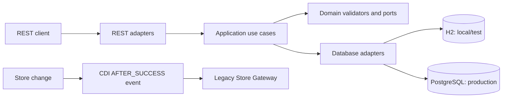

# Fulfilment & Warehouse Management Service

[](https://github.com/vikasr7572-collab/fulfilment-warehouse-assignment/actions/workflows/ci.yml)

Completed Senior Java Engineer coding assessment. This Quarkus service manages **products**, **stores**, and **warehouses**, with a bonus capability to allocate warehouses as fulfilment units for a product at a store.

The repository is designed to be easy to review: it includes runnable source code, automated tests, a JaCoCo coverage gate, Docker/PostgreSQL configuration, design answers, and application evidence.

## What is implemented

| Area | Delivered behaviour |
| --- | --- |
| Warehouse lifecycle | Create, replace, archive, and query warehouse business units with location, capacity, stock, and uniqueness validation. |
| Store integration | Store changes are persisted first; a CDI `AFTER_SUCCESS` observer then synchronizes the confirmed change with the legacy gateway. |
| Bonus fulfilment allocation | Allocates a warehouse to a store/product while enforcing the assignment limits required by the assessment. |
| Architecture | Warehouse and fulfilment logic follow a pragmatic hexagonal layout: domain rules and ports are separated from REST and database adapters. |
| Quality | 19 automated tests; JaCoCo enforces at least 80% instruction coverage for the core business-rule packages; GitHub Actions runs `mvn verify` on every push. |

## Application evidence

The screenshots below are captured from the running local Quarkus application using H2 sample data.

### Bonus: fulfilment allocation created successfully

The request creates an allocation for Store `1`, Product `2`, and Warehouse `1`.


### Warehouse inventory endpoint

The service returns active warehouse business units, their locations, capacities, and stock levels.


<details>
<summary>View product and store endpoint evidence</summary>

#### Product API


#### Store API


</details>

## Architecture at a glance



## Run locally

Prerequisite: **JDK 17+**.

```powershell
cd java-assignment
.\mvnw.cmd verify
.\mvnw.cmd quarkus:dev
```

The API starts at `http://localhost:8080`.

| Endpoint | Purpose |
| --- | --- |
| `GET /warehouse` | List active warehouse business units |
| `GET /product` | List products |
| `GET /store` | List stores |
| `POST /fulfilment-allocation` | Create a fulfilment allocation |

Example bonus request:

```powershell
Invoke-RestMethod -Method Post `
  -Uri "http://localhost:8080/fulfilment-allocation" `
  -ContentType "application/json" `
  -Body '{"storeId":1,"productId":2,"warehouseId":1}'
```

## Review checklist

- [Application setup and API details](java-assignment/README.md)
- [Original assignment requirements](java-assignment/CODE_ASSIGNMENT.md)
- [Technical design answers](java-assignment/QUESTIONS.md)
- [Case study](case-study/CASE_STUDY.md)
- [CI workflow](.github/workflows/ci.yml)
- [Build and test history / JaCoCo artifacts](https://github.com/vikasr7572-collab/fulfilment-warehouse-assignment/actions)

## Technology

Java 17 · Quarkus · Jakarta REST · Hibernate ORM / Panache · H2 · PostgreSQL · Maven · JUnit 5 · REST Assured · JaCoCo · Docker Compose · GitHub Actions
